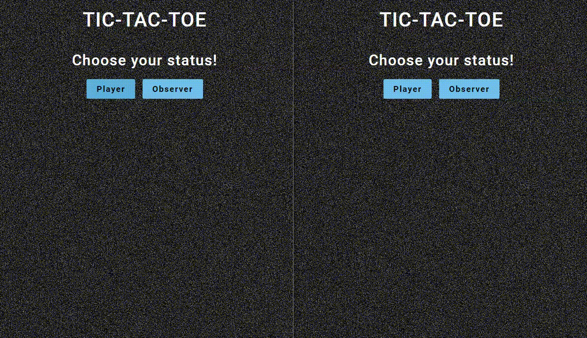

<h1 align="center">Крестики-нолики!</h1>

<p align="center">

</p>

<p >Данное приложение является многопользовательской игрой в крестики-нолики.</p>

_**[Развёрнуто здесь](https://djess-v.github.io/otus--homework--23/)**_

---

<h2>Визуальное представление</h2>



<h2>Описание приложения</h2>

<p >Первым шагом необходимо чтобы первый игрок создал комнату для игры.</p>
<p >Второму игроку необходимо выбрать комнату, которую создал первый игрок (выбрать соответствующий ID).</p>
<p >Можно начинать игру!</p>
<br/>
<p >В конце каждой партии будет предложено сыграть ещё партию.</p>
<p >В новой партии первым будет ходить тот игрок, который инициализировал создание комнаты (нажал первый на кнопку).</p>
<br/>
<p >Также игра подрузамевает возможность наблюдения за игрой 2-ух игроков, наблюдателям.</p>
<p >Для этого необходимо нажать соответствующую кнопку - Observer и выбрать комнату из предложенных на выбор.</p>
<br/>
<h3 >Приложение обрабатывает такие ситуации как: отключение сервера и отключение одного игрока от игры!</h3>

<h2>Для разработчиков:</h2>

<p >Клонируйте репозиторий.</p>

```properties
git clone https://github.com/Djess-V/otus--homework--22.git
```

<p >Перейдите в директорию - otus--homework--22.</p>

```properties
cd otus--homework--22
```

<p >Откройте второе окно терминала в данной директории и перейдите в этом терминале в директорию - server.</p>

```properties
cd server
```

<p >В обоих терминалах установите зависимости.</p>

```properties
npm ci   (2 раза!!!)
```

<p >В обоих терминалах запустите приложения в режиме разработки.</p>

```properties
npm start   (2 раза!!!)
```

<p >Всё! Теперь можно открыть приложение по адресу - http://localhost:9000/ в нескольких вкладках браузера и протестировать приложение.</p>
